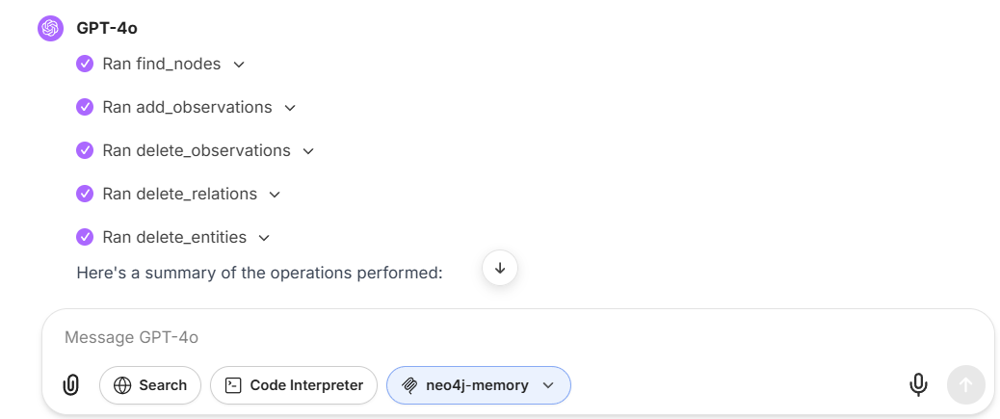

## **Minimum Changes Required for LibreChat Integration**

### **1. Add to LibreChat `docker-compose.override.yml` new services from `docker-compose.override.example.yml`**

### **2. Add to `.env` file**

```bash
# Neo4j Memory MCP Configuration
NEO4J_PASSWORD=your_strong_password_here
```

### **3. Add/Update `librechat.yaml`**

```yaml
# Add to librechat.yaml or create if it doesn't exist
mcpServers:
  neo4j-memory:
    type: sse
    url: http://mcp-neo4j-memory:3001/sse
    timeout: 30000
    initTimeout: 10000
```

## Launch LibreChat and wait until it starts (neo4j initialization could take few minutes)
 
```bash
docker-compose up -d
```

## Open LibreChat, open new chat, attach neo4j MCP server, ask to perform some operations

## Result



## **Key Points:**

1. **Container Names**: Use `neo4j-memory` (not `neo4j`) to avoid conflicts with existing Neo4j instances
2. **Network**: Use LibreChat's existing network or `default`
3. **Internal Communication**: Services communicate via container names (e.g., `http://mcp-neo4j-memory:3001/sse`)
4. **External Access**: Ports 7474/7687 are optional - only needed if you want to access Neo4j Browser from outside Docker
5. **Password**: Use a strong password and store it in `.env`
6. **Image**: You can use `lesykm/mcp-neo4j-memory:sse` or build from source
